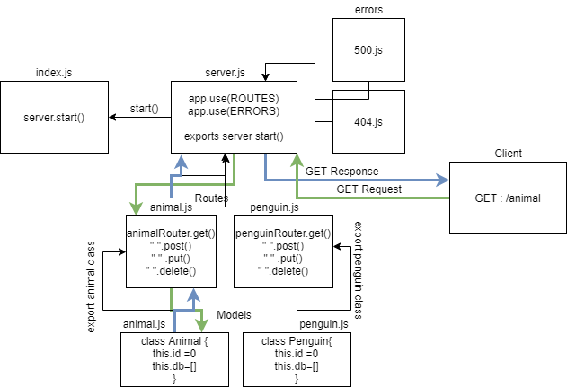

# Basic API Server

### Author: Mark Duenas

[Test Reports](https://github.com/MarkDuenas/basic-api-server/actions)

[Deployed Link](https://basic-express-md.herokuapp.com/)

[Pull Req](https://github.com/MarkDuenas/basic-express-server/pull/3)

## Set up

`.env` requirements

  - PORT - Port Number

  ### Running the app
   - npm start
    
   - Endpoint: GET /animal
     - Returns JSON Object of all animal in mock DB.

   - Endpoint: GET /animal/:id
     - Returns JSON Object of a single animal that corresponds to the id.

   - Endpoint: POST /animal
     - Inserts objet into mock DB.

   - Endpoint: PUT /animal/:id
     - Updates the animal with new request.body
     
   - Endpoint: PUT /animal/:id
     - Updates the animal with new request.body

   - Endpoint: GET /penguin
     - Returns JSON Object of all penguin in mock DB.

   - Endpoint: GET /penguin/:id
     - Returns JSON Object of a single penguin that corresponds to the id.

   - Endpoint: POST /penguin
     - Inserts objet into mock DB.

   - Endpoint: PUT /penguin/:id
     - Updates the penguin with new request.body

   - Endpoint: PUT /penguin/:id
     - Updates the penguin with new request.body
    
        
  ### Tests
    - Server Tests: `npm run test`
  
  ### UML

